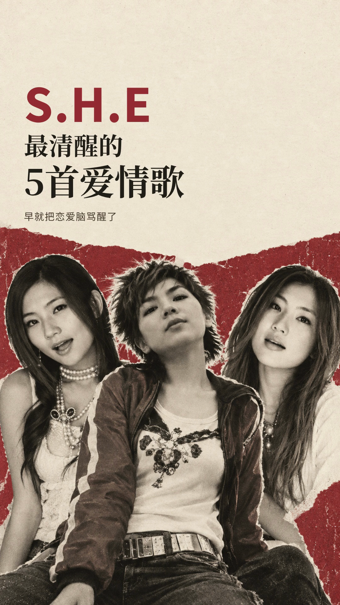

# 001 · S.H.E 最清醒的5首爱情歌

本例展示如何让一个明确的音乐观点、组合身份与有分量的中文标题，在竖屏封面中各有位置。米白纸面承载文字，暗红色呼应主题态度，三人黑白肖像在下方形成整体。

入选依据：用户于 2026-09-11 指定将本作品封面作为案例库的首个好例子。采用的是原项目 2026-09-09 修订的三人拼贴定稿。

[手机中央 3:4 预览](mobile-preview.png) · [无字生成底图](artwork.png) · [原始提示词](prompt.txt) · [来源与哈希](source.json)

## 作品表达

这期以五首爱情歌串起“爱一个人，也别委屈自己”的观点，属于非排名主题叙事。封面文案为：

> S.H.E
> 最清醒的 / 5首爱情歌
> 早就把恋爱脑骂醒了

“清醒”给出选题角度，“5首爱情歌”说明内容，三位成员共同建立组合身份。原项目从设限、拒绝讲到受伤后仍勇敢去爱，因此封面强调态度与人物，不使用名次、奖牌或重逢演唱会意象。

## 设计简述

| 选择 | 在本例中的作用 |
| --- | --- |
| 上方文字、下方三人肖像 | 让长中文标题有独立阅读空间，人物仍占据足够面积；两部分不互相遮挡。 |
| “S.H.E → 最清醒的 → 5首爱情歌 → 小字观点”的层级 | 暗红歌手名先建立身份；中文以语义分行，数量与主题组合成一个较大的阅读单元；副标题只补充观点。 |
| 米白、暗红、近黑 | 米白保持阅读区明亮，暗红把歌手名与下方色块联系起来；在本期表达中形成克制而有态度的观感。 |
| 三人黑白拼贴、撕纸边缘与轻颗粒 | 统一不同参考帧的色彩，保留人物的视觉差异；纸面与拼贴形成早期流行音乐杂志的联想。它是设计衍生图，不是历史合影。 |
| 无衬线歌手名与粗宋体中文搭配 | 用字形差异帮助分层；中文标题有视觉重量，小字回到简洁的无衬线。 |
| 右上留白与下方人物呼应 | 文字左对齐，人物横向铺开；不为填满空白再添道具、标签或装饰。 |

以上是根据原项目设计记录与本次实际查看归纳的设计理由，不是用户逐项评价。

## 提示词与实际制作的关系

[prompt.txt](prompt.txt) 原样保存 `cover-generation-prompt-v2.txt`，只负责生成**无文字的人物拼贴与背景**。最终可见的中英文标题由原项目离线字体排版完成，不能把这段提示词当成整张带字封面的全部制作步骤。

提示词的结构值得借鉴：先写用途与主题，再区分身份参考和布局参考，明确人数、主体关系、标题留白、颜色、质感以及需要排除的元素。具体角色、位置、比例和颜色都只针对本期。

| 提示词输入顺序 | 本例保留的参考图 | 原记录中的来源状态 |
| --- | --- | --- |
| image 1 · Ella | [inputs/ella.png](inputs/ella.png) | 原项目 `raw/s02.mp4` 的 70 秒，来源 URL 保存在 source.json。 |
| image 2 · Hebe | [inputs/hebe.png](inputs/hebe.png) | 复用已有参考图；原记录未给出视频 URL 与提取时刻，保留该缺口。 |
| image 3 · Selina | [inputs/selina.png](inputs/selina.png) | 原项目 `raw/s01.mp4` 的 130 秒，来源 URL 保存在 source.json。 |

生成记录中的工具是 `image_gen.imagegen`，时间为 `2026-09-09T11:01:27+08:00`；工具未回传具体模型标识，本例不推测。原提示词包含对身份、发型与来源的要求，代表当时输入意图，不证明结果逐项满足或所有来源已重新核验。

实际保存的无字底图为 941×1672；原项目以居中覆盖方式置入 1080×1920 画布，再叠加标题。定稿 [cover.png](cover.png) 为 1080×1920，原记录标记它来自最终 mux 后 MP4 的第 0 帧。本次按字节复制该定稿，并核对其 SHA-256 与原记录一致。

排版使用 `NotoSansSC.woff2` 与 `NotoSerifSC-Bold.woff2`。原工程文字组距顶部 256 px、左右边距 76 px；歌手名 146 px，两行中文分别为 78 / 112 px，副标题 31 px。主色为米白 `#f2eadc`、暗红 `#982c36`、近黑 `#231f1b`。这些数值仅用于理解本例比例，不是后续作品的默认参数。

## 如何借鉴，哪些应重新判断

- **可迁移的方法**：先分配文字与人物空间，再生成底图；让歌手身份、选题角度和补充观点有层级；以有限的颜色组织图像与字体；最终检查缩略图和裁剪，而非只看大图。
- **本期特定选择**：三人并置、黑白拼贴、米白与暗红、粗宋体、上字下人、“最清醒”及“骂醒”的文案。后续应根据人数、音乐情绪、时代语境和标题长度重新决定，不要求延续这一外观。
- **适用问题**：需要同时呈现组合成员与较长主题标题，希望先把观点说明白。更依赖舞台动作、服装细节、轻快氛围或单人表演张力的作品，应从相应主体出发组织封面。

## 本次归档检查与边界

2026-09-11，Codex agent 实际查看了完整定稿、无字底图与 360×480 中央 3:4 预览：歌手名与两行主题可读，三张脸均可见，文字未压脸。手机预览中副标题明显较小，适合作补充；若下一期的信息必须在缩略图中读清，应重新调整字号和密度。

中央 3:4 预览只覆盖这一裁剪方式，不代表所有平台界面都已验证。本次为本地案例归档，检查复制文件、尺寸、哈希及文档对应关系；没有重新生成图片、修改视频、核验在线来源或执行整片 QA。入选不附带点击率、真人听审或发布验收结论。

## 留存与追溯

原项目：`sandbox/she-awake-love-five`（内部测试）。[设计记录](../../../sandbox/she-awake-love-five/design.md) 与 [原封面来源](../../../sandbox/she-awake-love-five/assets/cover-source.json) 是当前工作区的追溯入口；若 sandbox 日后清理，本目录仍可独立查看图片、提示词与设计简述。

[source.json](source.json) 包含归档文件到原项目文件的映射、SHA-256、实际尺寸及原 `cover-source.json` 的完整内容。嵌入的原记录路径均相对原项目，归档文件路径则相对此案例目录；其中原视频哈希只保留作历史关联，不表示本次重新验收了该视频。
