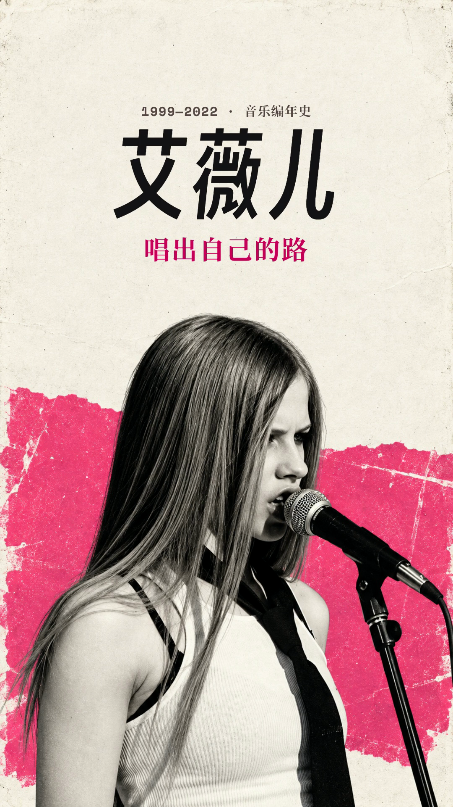

# 002 · 艾薇儿 · 唱出自己的路

本例展示单人音乐编年作品如何以姓名、观点和演唱姿态建立封面重心。居中的大字、侧向演唱人像与热粉色块形成呼应；最终精简版让这一画面连续保持到第一章。

入选依据：用户于 2026-09-11 评价这期封面“非常不错”，要求在 S.H.E 之后收录。采用的是原项目 2026-09-09 的 `cover-clean` 精简版。

[手机中央 3:4 预览](mobile-preview.png) · [无字生成底图](artwork.png) · [原始提示词](prompt.txt) · [来源与哈希](source.json)

## 作品表达

原项目用音乐编年串起“唱出自己的路”的主题，关注歌手如何持续定义自己的声音。封面文字只保留三个信息组：

> 1999—2022 · 音乐编年史
> 艾薇儿
> 唱出自己的路

“艾薇儿”承担最强的身份识别，“唱出自己的路”给出作品角度，年代与类型合成一行辅助信息。画面中的演唱表情、长发、眼妆、领带和麦克风与主题相连，图像不需要再叠一段人物介绍。

## 设计简述

| 选择 | 在本例中的作用 |
| --- | --- |
| 居中的巨大姓名与短主题句 | 三字姓名形成集中、清楚的视觉重心；主题句用较小字号和粉色补充观点，信息组彼此有距离。 |
| 年代与“音乐编年史”合为一行 | 一次交代内容范围，避免年份、英文名、解释段落同时争抢注意力。位置在上方，视觉权重仍小于姓名。 |
| 下半幅的大幅演唱肖像 | 让封面保留歌手正在唱歌的状态，麦克风强化音乐主题；人物偏左的体量与伸向右侧的麦克风形成呼应。 |
| 暖纸白、黑白人像与热粉纸面 | 明亮阅读区支撑黑色标题，热粉集中在主题句及人物身后的色块；纸面与印刷质感呼应原项目的早期流行朋克视觉方向。 |
| 倾斜海报字与衬线主题句 | 字形差异帮助分层；大字有演出海报的力度，主题句保持清楚、稳定的阅读节奏。 |
| 移除早期影像小窗与额外切换 | 保持人像、标题和色块组成的完整画面，让开场内容连续，不让额外画面打断封面的表达。 |

以上设计理由来自原项目记录与本次实际查看的归纳，不代表逐项用户评价。

本例有一条明确的取舍记录。用户当时要求：

> 中间这一段早期公开镜头，和你的设计不太搭，直接去掉吧，让封面更纯粹，现在还为这个额外切换了一次画面，观感很差。

原项目随后移除了小窗、附带文字、入退场动画及肖像背景的淡出/恢复，保留已采用的人像与标题。值得借鉴的是检查额外元素是否服务当前画面；若另一作品的核心表达需要动态素材或证据窗口，仍应按内容判断，不把这次取舍推广为所有封面必须静止。

## 提示词与实际制作的关系

[prompt.txt](prompt.txt) 原样保存原项目 `cover-generation-prompt.txt`，要求模型编辑真实演唱参考，保留人物识别、演唱表情及关键服饰，把它转成无字的音乐海报底图，并为后期中文标题留出空间。

输入参考为 [inputs/avril.png](inputs/avril.png)。原项目 `design.md` 记录它取自本地《Complicated》MV 的 35.000 秒，文件为 `raw/complicated-yt-5NPBIwQyPWE.mp4`；原 `SOURCES.md` 对应 URL 已保存在 [source.json](source.json)。本次沿用本地记录，没有联网重新核验。

原记录使用 `image_gen.imagegen`，未返回可核实的模型版本；也没有留存精确生成时刻，仅记录 2026-09-09 封面修订日期。采用的底图为 941×1672，原项目居中覆盖到 1080×1920 画布，再独立叠加中文与年代文字。它是照片衍生设计，不是新发现的历史照片。

提示词中值得参考的写法包括：明确要保留的身份与演唱细节、把人物区与标题区分开、限定色块和质感、说明文字另行排版、排除无关装饰。具体坐标、热粉配色和服饰要求都属于本例，不能原样套给其他歌手；提示词描述是生成意图，实际成稿仍需检查。

原工程封面文字组左侧 90 px、顶部 244 px、宽 900 px，居中对齐；年代 31 px，姓名 224 px，主题句 62 px。姓名使用 `SmileySans-Oblique`，主题句使用 `NotoSerifSC-Regular` 字体文件，年代以 `Space Mono` 搭配中文衬线字体。正文项目虽有其他配色与动画，封面只采用与本期主视觉相关的部分。

封面 CSS 中姓名为 `#171418`、主题句为 `#c90059`、年代为 `#594748`；生成提示词使用暖白纸面与热粉方向，原项目视觉系统记录热粉 `#FF2E93`。区分实际排版颜色与生成图的颜色方向，不把生成纸面的像素假定为单一精确色值。这些参数只说明本例实现比例，不作为全局默认。

## 如何借鉴，哪些应重新判断

- **可迁移的方法**：以姓名和一句作品观点建立核心；让动作、道具与音乐内容有关；用人物朝向和附属形体平衡画面；通过删减保持开场视觉连续。
- **本期特定选择**：单人侧向演唱、领带与麦克风、热粉、复印纸质感、居中大姓名、这段年代范围及较长开场。下一期需重新判断主体、色彩、字数和停留时长。
- **适用问题**：单人音乐历程、身份需要强识别、希望用一个演唱瞬间撑起主视觉。多人组合、较长主题标题或以舞台全景为重点的作品，可能需要不同的重心与信息安排。

与 [001 · S.H.E](../001-she-awake-love-five/README.md) 对照时，可观察多人并置与单人演唱、左对齐长标题与居中短姓名各自如何组织视线。两者共有纸面与黑白人物，不意味着后续封面都应沿用这种外观。

## 本次归档检查与边界

2026-09-11，Codex agent 实际查看了完整定稿、无字底图与本次从定稿生成的 360×480 中央 3:4 预览：姓名、主题句和演唱主体清楚，面部与麦克风可见，文字未压脸。3:4 裁剪后顶部年代行余量较小、字号也小；它在本例是辅助信息，若下一期需要更强年代识别或更紧裁剪，应重新留出安全空间。

定稿与原项目 `qa/cover-clean/cover.png`、`qa/cover-clean/at-0s.png`、`qa/final-frames/00-cover.png` 按字节一致。手机预览仅对该定稿做中央裁剪和缩放，不使用早期 `cover-revision` 的旧预览。

本次没有重新生成主视觉、修改视频或执行整片 QA。开场持续保持封面的历史记录取自原项目 `qa/cover-clean/README.md`；本次未重新播放全片验证，也不将历史技术检查当作播放表现、真人听审或发布验收。

## 留存与追溯

原项目：`sandbox/avril-lavigne-music-chronicle`（内部测试）。当前工作区可追溯 [设计记录](../../../sandbox/avril-lavigne-music-chronicle/design.md) 与 [封面精简记录](../../../sandbox/avril-lavigne-music-chronicle/qa/cover-clean/README.md)。原设计文档其他章节保留了早期动效构想，本案例以其中更新后的封面段落及 `cover-clean` 记录为准。

[source.json](source.json) 保存原文件映射、SHA-256、实际尺寸、提示词输入/输出关系、来源段落及精简记录快照。清理 sandbox 后，本例的图片、提示词与设计简述仍可独立使用；原视频哈希仅作为历史关联保留。
