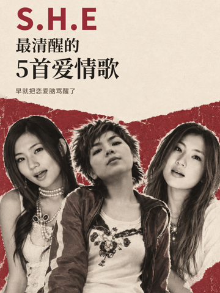
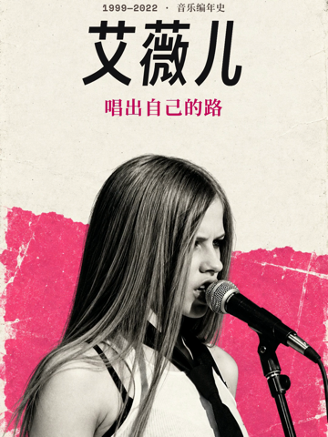
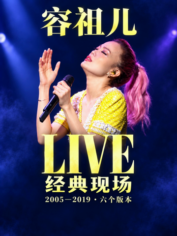

# 音乐作品封面案例库

这里独立留存值得参考的封面定稿、实际采用的提示词和设计简述，帮助后续音乐盘点、主题叙事与音乐编年作品做出更好的设计判断。

**案例只是辅助参考。本期作品的表达始终优先，不要求复刻任何案例，也不把某个案例的构图、颜色、字体或提示词当作默认模板。** 看案例时重点理解“为什么这样设计、解决了什么问题”，再判断哪些方法适合本期。

## 如何使用

1. 先用一句话写清本期的主题与情绪，确定观众首先应认出谁、读到什么。已有 brief 可直接作为依据。
2. 从下方索引挑与本期设计问题有关的案例，查看定稿图、提示词、设计简述；编辑型提示词同时查看输入参考图。无需逐个遍历，也没有必须采用的数量。
3. 提炼可借鉴的方法，例如信息层级、主体安排、留白或图文协作。重新决定本期构图、配色、字体与文案，不只替换歌手和标题，不原样套用整段提示词。
4. 在本期 `design.md` 简记参考了哪例、借鉴什么、如何适应本期内容；无合适案例则直接说明自己的设计依据，继续创作。
5. 用本期实际封面、第 0 帧、手机尺寸和目标裁剪复核结果。案例不能替代 [全局视觉规范](../../CONVENTIONS.md#字幕与视觉)、[AIGC 生图流程](../../CONVENTIONS.md#封面图像生成流程) 和本期技术 QA。

这不是审批环节，不需要等用户选案例。相似或不同本身都不是目标；每项视觉选择能否支持作品表达才是判断依据。

## 案例索引

| 编号 / 作品 | 内容与设计问题 | 值得借鉴的设计方法 | 图像与提示词 |
| --- | --- | --- | --- |
| [001 · S.H.E 最清醒的5首爱情歌](001-she-awake-love-five/README.md) | 非排名爱情观叙事；三人身份与强主题标题同屏 | 上方标题、下方人物；明确的信息层级；AIGC 无字底图与离线字体分开完成 | [定稿](001-she-awake-love-five/cover.png) · [底图](001-she-awake-love-five/artwork.png) · [提示词](001-she-awake-love-five/prompt.txt) |
| [002 · 艾薇儿 · 唱出自己的路](002-avril-lavigne-music-chronicle/README.md) | 单人音乐编年叙事；姓名、观点与年代分层 | 居中大字与演唱姿态配合；热粉强化主题气质；删去不相容小窗，保持开场视觉连续 | [定稿](002-avril-lavigne-music-chronicle/cover.png) · [底图](002-avril-lavigne-music-chronicle/artwork.png) · [提示词](002-avril-lavigne-music-chronicle/prompt.txt) |
| [003 · 容祖儿 LIVE · 经典现场](003-joey-yung-classic-live-chronicle/README.md) | 六个现场版本的时间叙事；演唱情绪与现场类型同屏 | 舞台动作成为主视觉；从服装提取亮黄，与深蓝形成对比；通过第二轮编辑改善手机裁剪 | [定稿](003-joey-yung-classic-live-chronicle/cover.png) · [生成整图](003-joey-yung-classic-live-chronicle/artwork.png) · [两轮提示词](003-joey-yung-classic-live-chronicle/prompt.txt) |

中央 3:4 手机预览（三例定稿原图均为 1080×1920）：

| 001 · S.H.E | 002 · 艾薇儿 | 003 · 容祖儿 |
| --- | --- | --- |
|  |  |  |

前两例用纸面质感与黑白人物，第三例用彩色舞台与演唱动作，分别服务不同作品。后续仍按作品表达选择视觉方向，不把“纸面、黑白人像、上字下人”或“深蓝、亮黄、舞台海报”固定成标准答案。

## 设计标准：用于判断，不限定风格

| 维度 | 判断问题 |
| --- | --- |
| 作品表达 | 能否看出这期讲什么、情绪是什么？画面与音乐内容、歌手形象是否相称？ |
| 信息层级 | 主体身份、主题、补充信息是否有清楚的阅读顺序？标题有没有重复、孤字或不自然断行？不强制所有作品采用同一种顺序。 |
| 主体与构图 | 主体是否清楚，人物是否互相遮挡，文字是否挡脸？留白是否帮助阅读、平衡画面，而非用装饰填空？ |
| 颜色与字体 | 配色和字体是否有本期内容依据、彼此协调、对比足够？不因旧案例好看就固定用同一套。 |
| 信息与装饰 | 每个元素是否帮助表达？无关道具、重复角标或生硬拼接是否分散注意力？不以元素数量衡量质量。 |
| 实际显示 | 完整封面、第 0 帧、手机缩略图和目标裁剪下，必要文字及主体是否仍然清楚？不依赖放大才能理解主题。 |
| 图像与制作依据 | 人物和关键细节是否检查过？是否区分原始参考、AIGC 衍生图和最终排版？提示词、采用版本与来源能否对应？ |

这些标准帮助评估设计，不是点击率保证。入选理由与技术检查、真人评价、来源核验各自记录，不互相替代。

## 目录与新增案例

每例使用稳定编号加作品 slug；新增时取索引中最大编号加一，保留三位编号。每个目录独立保存必要图片，不使用指向 sandbox 或工具缓存的软链接。

```text
references/covers/
├── README.md
└── 001-she-awake-love-five/
    ├── README.md           # 作品表达、设计简述、借鉴点和适用边界
    ├── cover.png           # 实际定稿，包含最终文字排版
    ├── prompt.txt          # 实际采用版本的完整原始提示词
    ├── source.json         # 原项目、工具/模型、版本、文件映射与 SHA-256
    ├── artwork.png         # 采用的生成图：无字底图或含字整图（如有）
    ├── mobile-preview.png  # 手机尺寸 / 目标裁剪预览（如有）
    └── inputs/             # 原提示词所依赖的必要输入参考（如有）
```

- 每例至少包含定稿图、提示词、设计简述和来源记录。设计简述写清作品语境、关键选择及理由、可迁移的方法、只适合本期的选择、实际查看范围和已知局限；不要只写“高级”“好看”。
- 原始提示词按采用版本保存，不事后改写成理想提示词。中文解读、改进建议写在设计简述里，并标明是归纳。多轮生成确实参与定稿时，按顺序保存相关提示词及输入/输出映射；缺失信息明确写未留存，不伪造。
- 记录实际工具、可取得的模型标识、原项目与资产路径、生成版本和归档日期；模型未回传时如实写未知。为本地归档文件保存 SHA-256，原项目的来源缺口也原样保留。
- 输入图、采用生成图和定稿分开存放，说明文字由模型生成还是后期排版；若上一轮图是采用编辑的输入，一并保留在 `inputs/` 并记录步骤。仅归档已有定稿无需重新生图、改片或刷新整片 QA。
- 入库依据可为用户指定的好例子，或有明确设计理由与实际图像观察的精选作品；注明选择依据和观察者身份，不写成未经确认的用户审美批准或播放数据结论。
- 更新本页索引。若更换同例定稿，核对对应提示词、底图、设计简述和哈希，一并更新版本说明；原作品的另一种独立设计方向可另建案例。
- Git 仅对上述命名的必要 PNG 图像作窄范围放行。每例只保存采用版本和必要输入，避免搬入整片视频、普通抽帧、缓存或整套下载素材；其他图片格式按需增加明确例外，不全局放开图片忽略规则。

案例图片和设计记录是长期参考资产。原作品的测试/生产用途及来源边界继续保留，入库本身不代表原作品已公开发布或素材已获授权。
